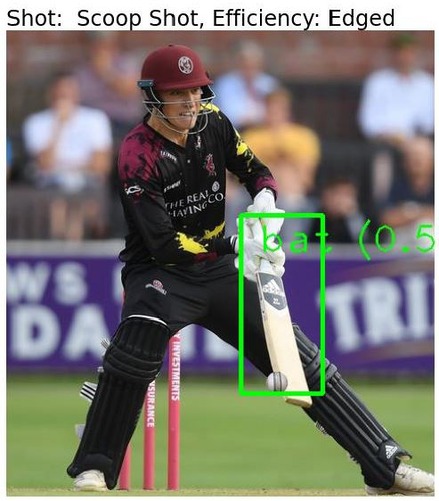

# cricket-shots
Cricket :cricket_game: is often described as a contest between bat and ball, and batting is considered one of its prime disciplines. While batting a batter tries to hit the ball with a different variety of shots to guide the ball in any specific direction of their wish. The types of shots include cover drive, straight drive, pull shot, reverse sweep, and many more. It is tedious task to classify shots manually and provide the insights for the batsman. Our goal is to classify the shot using AI and to provide an analysis of how well someone plays a particular shot. This can be achieved by collecting the required image data, extracting features, feeding to the machine learning or deep learning algorithms, and generating the classifier output. We have implemented the model using SVM which works better with less data.

# TO RUN THIS PROJECT

1. Clone this repo:  
<code>git clone https://github.com/gtmray/cricket-shots.git </code>

2. Create virtualenv and activate:  
<code>virtualenv env </code> 
<code>.\env\Scripts\activate</code>

3. Install dependencies: 
<code>pip install -r requirements.txt</code>

4. Bat Detection: 
<code>py predict_bat.py IMAGE_PATH</code>

5. Shots Classification: 
<code>py predict_shot.py model/shot_classification.pkl IMAGE_PATH</code>

6. For running API: 
<code>uvicorn fast_api:app</code> 
<code>or py -m uvicorn fast_api:app</code>

7. Predict shots and efficiency: 
<code>py shots_eff.py IMAGE_PATH</code>

# Output

.

